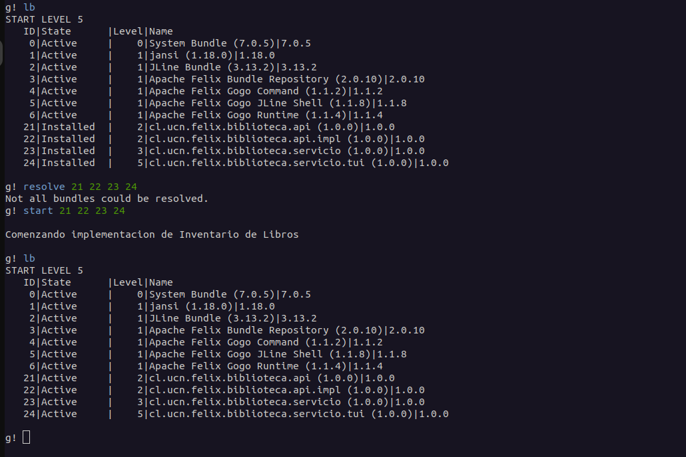

# Apache Felix Library Management Project Documentation

## Project Overview
This project aimed to implement a comprehensive library management system using Apache Felix. The process involved developing various functionalities, importing necessary packages, and modifying throw statements in some functions.

## Bundle Installation and Activation
In the Felix console, the following steps were executed for bundle management:

1. Set bundle and framework levels and install bundles:
   ```
   bundlelevel -i 2
   frameworklevel 2
   install file:///home/daniel/releases/cl/ucn/felix/cl.ucn.felix.biblioteca.api/1.0.0/cl.ucn.felix.biblioteca.api-1.0.0.jar    
   install file:///home/daniel/releases/cl/ucn/felix/cl.ucn.felix.biblioteca.api.impl/1.0.0/cl.ucn.felix.biblioteca.api.impl-1.0.0.jar 
   bundlelevel -i 3
   frameworklevel 3
   install file:///home/daniel/releases/cl/ucn/felix/cl.ucn.felix.biblioteca.servicio/1.0.0/cl.ucn.felix.biblioteca.servicio-1.0.0.jar  
   bundlelevel -i 5
   frameworklevel 5
   install file:///home/daniel/releases/cl/ucn/felix/cl.ucn.felix.biblioteca.servicio.tui/1.0.0/cl.ucn.felix.biblioteca.servicio.tui-1.0.0.jar    
   ```

2. Resolve and start bundles:
   ```
   resolve ID1 ID2 ID3 ID4
   start ID1 ID2 ID3 ID4
   ```


   
3. Usage of library functions:
   - To add books:
     ```
     libro:adicionar admin admin 1234567890 "El Principito" "Antoine de Saint-Exupéry" "Novela"
     libro:adicionar admin admin 2345678901 "Cien Años de Soledad" "Gabriel García Márquez" "Novela"
     libro:adicionar admin admin 3456789012 "1984" "George Orwell" "Ciencia Ficción"
     libro:adicionar admin admin 4567890123 "Fahrenheit 451" "Ray Bradbury" "Ciencia Ficción"
     libro:adicionar admin admin 5678901234 "Don Quijote" "Miguel de Cervantes" "Clásico"
     ```

   - To search books:
     ```
     libro:buscar admin admin autor "Gabriel García Márquez"
     libro:buscar admin admin categoria "Ciencia Ficción"
     ```

## Implemented Methods
Several methods were implemented for the library management system, including:

1. `obtenerGrupos`
2. `adicionarLibro`
3. `modificarCategoriaLibro`
4. `removerLibro`
5. `buscarLibrosPorCategoria`
6. `buscarLibrosPorAutor`
7. `buscarLibrosPorTitulo`

`ServicioImplActivador` class was implemented for bundle activation and service registration:

1. `start`
2. `stop`

Additionally, a the constructors for `ExcepcionCredencialInvalida` class and `ExcepcionSesionNoValidaTiempoEjecucion` were implemented.

## Video Explanation
A video explaining the bundle loading process and the use of the library to add and search for books:


